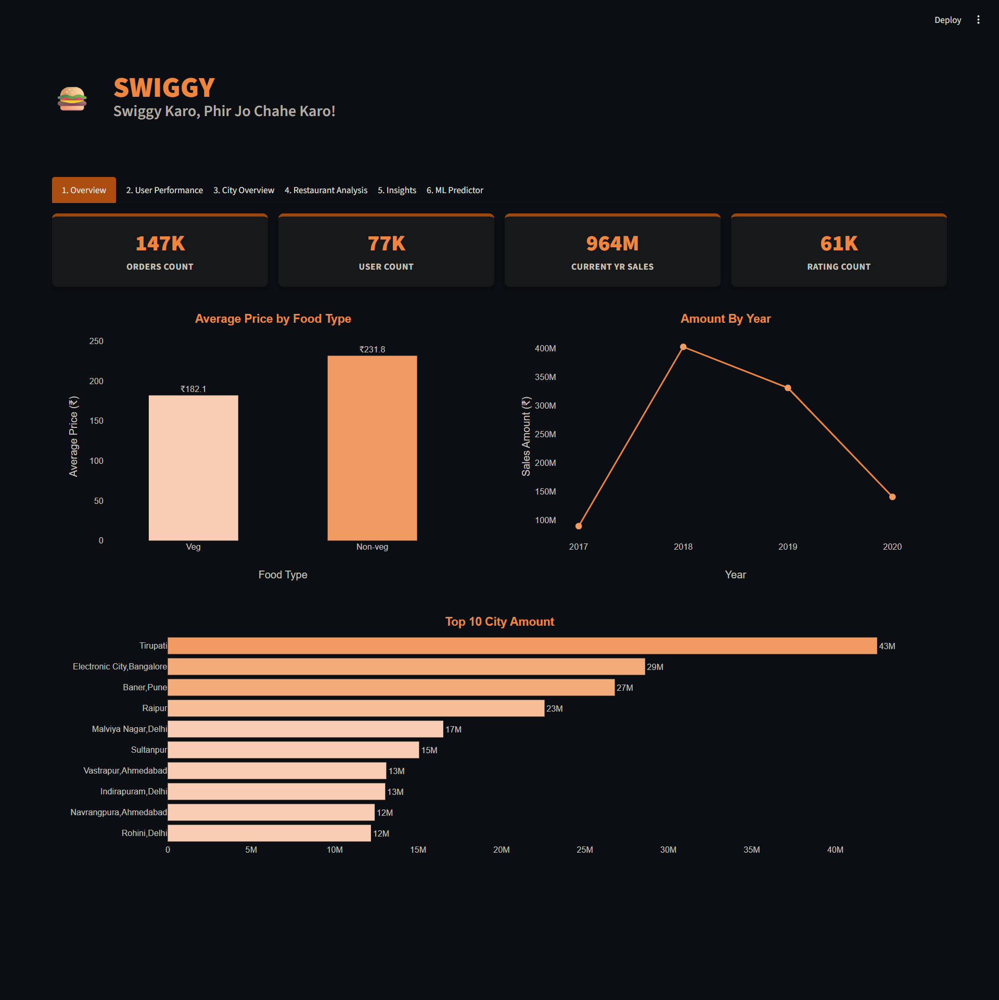
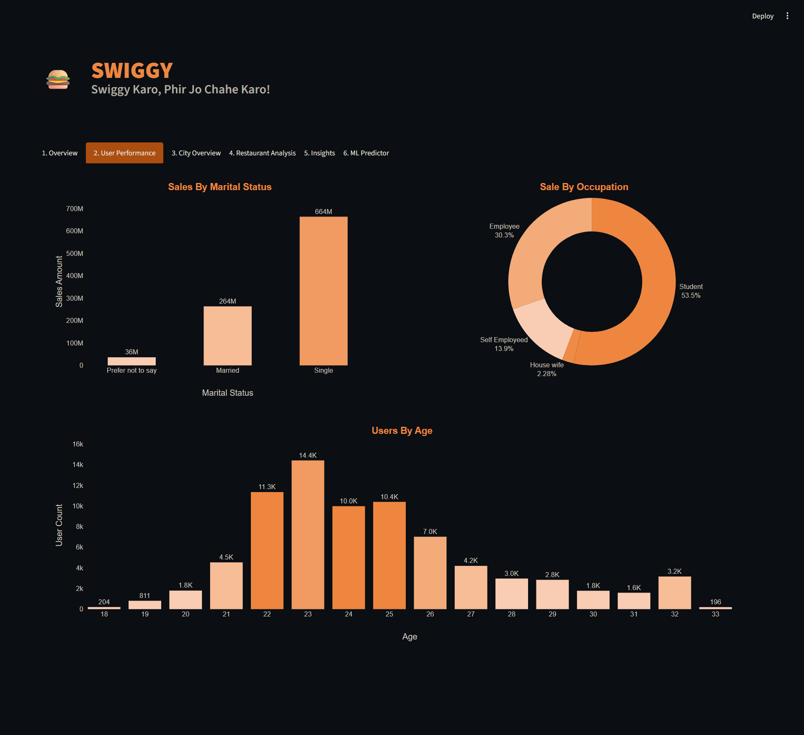
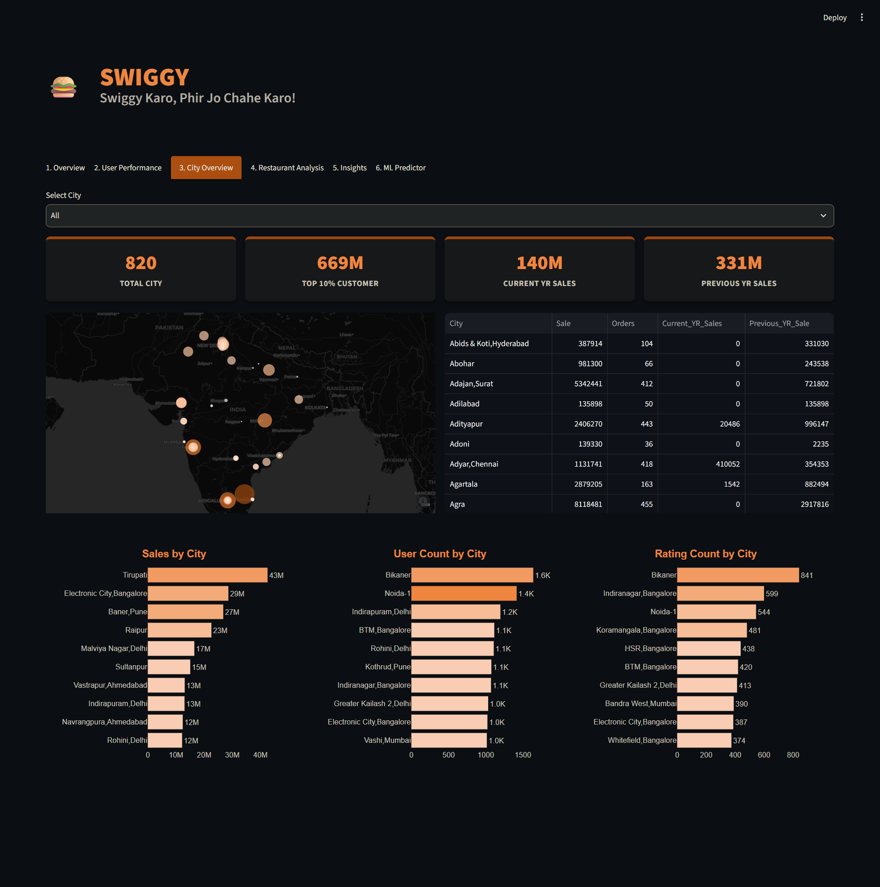
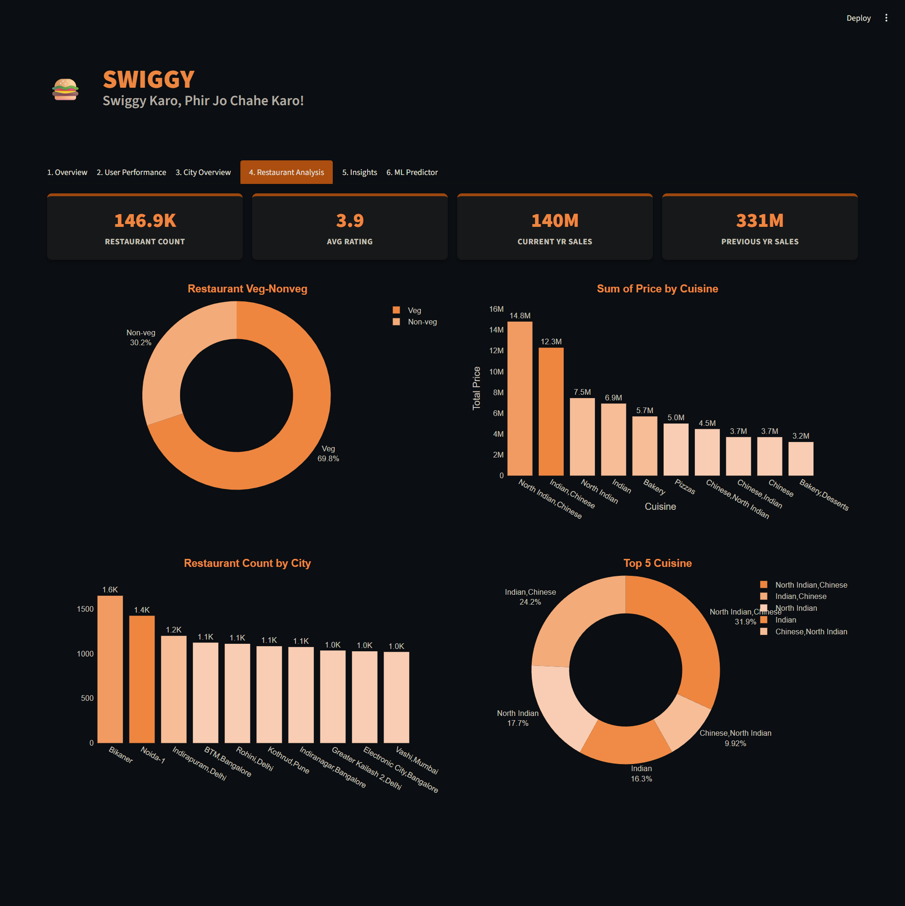
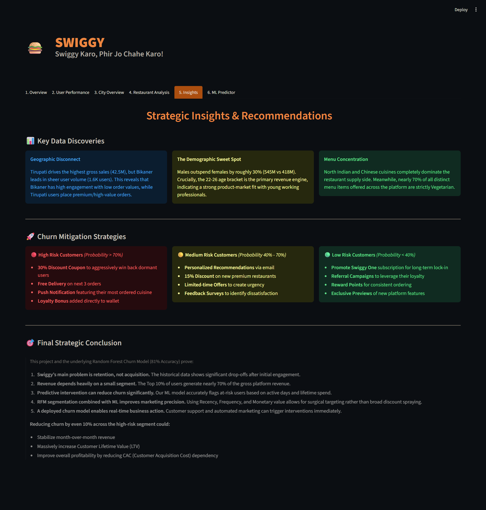
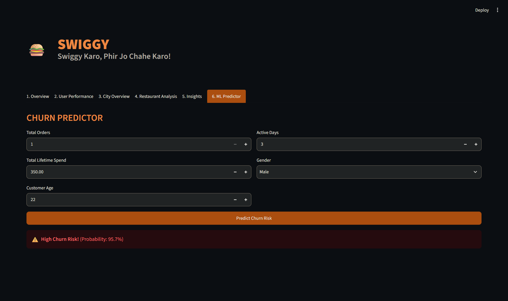
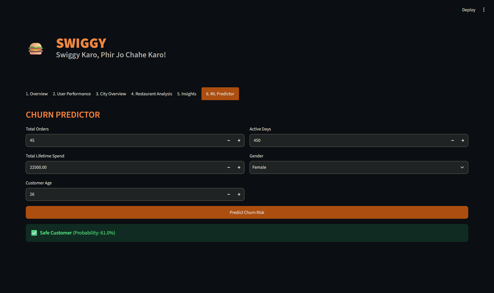

# 🍔 Swiggy End-to-End Data Analytics & Business Intelligence

An end-to-end data analytics project built on Swiggy's order, user, restaurant, and menu data — covering exploratory data analysis, statistical hypothesis testing, RFM customer segmentation, machine learning-based predictive modeling, and a fully interactive Streamlit dashboard.

---

## 📌 Problem Statement

Swiggy, like most on-demand food delivery platforms, generates massive volumes of transactional and behavioral data every day. However, raw data by itself does not tell the business where revenue is concentrated, which customers are at risk of leaving, or which cities and cuisines are driving growth.

This project sets out to convert Swiggy's raw operational data (users, orders, restaurants, and menu items) into a decision-ready analytics system — one that can quantify revenue volatility, identify high-value customer segments, statistically validate key business drivers, and proactively flag at-risk customers based on engagement trends.

## 🎯 Objectives

- Consolidate five disparate data sources (Users, Orders, Restaurants, Menu, Food) into a single analytical dataset.
- Perform in-depth exploratory data analysis to understand revenue trends, distribution, and customer behavior.
- Apply statistical hypothesis testing to validate whether highly engaged and dormant customers differ significantly in ordering behavior.
- Segment customers using RFM (Recency, Frequency, Monetary) analysis to prioritize business efforts.
- Build and compare multiple machine learning models to predict customer drop-off without data leakage.
- Deploy an interactive, Streamlit dashboard for business stakeholders to explore insights and run live ML predictions.
- Translate analytical findings into actionable business recommendations.

---

## 🗂️ Dataset Architecture

### Tables Used (5 Tables)

| # | Table | Description |
|---|--------|-------------|
| 1 | **Users** | Customer demographic data — Age, Gender, Marital Status, Occupation |
| 2 | **Orders** | Transactional order data — order date, quantity, sales amount, user & restaurant references |
| 3 | **Restaurants** | Restaurant metadata — name, country, city, rating, rating count, cuisine |
| 4 | **Menu** | Menu items offered per restaurant, linked to food items |
| 5 | **Food** | Food item master data referenced by the menu |

### Data Relationships

```
Users        (1) ────< (Many)  Orders
Restaurants  (1) ────< (Many)  Orders
Restaurants  (1) ────< (Many)  Menu
Menu         (1) ────< (Many)  Food
```

### Table Sizes

| Table | Rows | Columns |
|---|---|---|
| Users | 100,000 | 6 |
| Restaurants | 148,454 | 7 |
| Orders | 150,281 | 6 |
| Menu | 1,048,574 | 5 |
| Food | 371,552 | 3 |
| **Merged Analytical Dataset (`food_df`)** | **147,063** | **18** |

**Total Records Across All Raw Tables: 1,818,861**

---

## 🛠️ Tech Stack

| Category | Tools / Libraries |
|---|---|
| Language | Python 3.11+ |
| Data Processing | pandas, numpy |
| Statistical Analysis | scipy (t-tests) |
| Visualization (Notebook) | matplotlib, seaborn |
| Visualization (Dashboard) | plotly |
| Machine Learning | scikit-learn, XGBoost, LightGBM, CatBoost |
| Model Serialization | joblib |
| Dashboard Framework | Streamlit |
| Notebook Environment | Jupyter, ipykernel, nbformat, nbclient |
| Package Management | uv (`pyproject.toml`, `uv.lock`) |

---

## 📁 Folder Structure

```
├── .python-version
├── .streamlit
│   └── config.toml                       # Dashboard theme configuration
├── Data
│   ├── Food.csv
│   ├── Menu.csv
│   ├── Orders.csv
│   ├── Restaurant.csv
│   └── Users.csv
├── Processed_Data
│   ├── best_churn_model.pkl              # Serialized production churn model
│   ├── processed_orders.csv              # Cleaned, merged order-level dataset
│   ├── processed_users_rfm.csv           # User-level features + RFM segments
│   └── scaler.pkl                        # Fitted StandardScaler for inference
├── README.md
├── Swiggy Churn Analysis And ML.ipynb    # Full EDA, statistics & ML pipeline
├── app.py                                # Streamlit dashboard application
├── generate_summary.py
├── project_codes_and_outputs.txt
├── pyproject.toml
├── requirements.txt
└── uv.lock
```

---

## 📊 Key Business Insights (EDA & Statistical Testing)

The notebook walks through 14 structured business questions across exploratory and statistical analysis:

**Q1: Is Revenue Growing or Volatile?**
Monthly revenue was plotted over time. Revenue Volatility (Std Dev): **₹5,384,851.65**; Coefficient of Variation: **0.1843** — indicating moderate, manageable volatility rather than runaway swings.

**Q2: Is Revenue Distribution Skewed?**
The distribution of `Sales_amount` is heavily right-skewed. Skewness: **18.36**, Kurtosis: **560.97** — confirming a small number of very large transactions pull the distribution, reinforcing the need for outlier-aware modeling.

**Q3: Which Cities Are Statistically Dominant?**
A boxplot of revenue distribution across the top 10 cities (by order volume) revealed significant spread differences, confirming that city-level performance is not uniform across the platform.

**Q4: What Is the Distribution of Customer Lifetime Value (CLV)?**
A Pareto (80/20) curve was built on cumulative revenue vs. cumulative customers. Mean CLV: **₹12,484.74**; Median CLV: **₹1,921.00** — the large gap between mean and median confirms revenue is concentrated in a small subset of high-value customers.

**Q5 & Q6: Age vs Spending & Ratings vs Revenue**
Correlation between Age and Sales_amount: **-0.0007**; Correlation between Rating Count and Sales_amount: **-0.0019**. Both are statistically negligible — spending is not meaningfully explained by age or restaurant rating volume alone.

**Q7 & Q8: Order Frequency & Recency vs Revenue**
Order frequency distribution and a Recency-vs-Lifetime-Revenue regression were plotted, showing how recently active customers relate to their cumulative spend.

**Q9 & Q10: Active vs Dormant Profiling (T-Tests)**

| Metric | Active | Dormant |
|---|---|---|
| Total Orders | 2.41 | 1.83 |
| Total Revenue | ₹16,414.50 | ₹11,936.43 |
| Recency (days) | 44.63 | 470.79 |
| Avg Order Value | ₹6,716.11 | ₹6,442.92 |

- Orders T-test p-value: **0.0**
- Revenue T-test p-value: **1.51 × 10⁻²²**

Both results are statistically significant, confirming dormant and active users are genuinely different populations in ordering behavior and revenue — not due to random chance.

**Q11 & Q12: Feature Importance & RFM Segmentation**
Correlation with inactivity: Total Orders **-0.184**, Total Revenue **-0.035**, Recency **0.513**, Avg Order Value **-0.004**. Recency is by far the strongest drop-off signal. Customers were scored on Recency, Frequency, and Monetary value (R/F/M quintiles) and segmented into **Champions**, **Loyal Customers**, **Potential Loyalists**, and **At Risk / Dormant**.

**Q13 & Q14: Overall Drop-off Rate & Outliers**
Overall Drop-off Rate: **87.76%** (defined as no order in the last 90 days). Outliers detected via IQR method: **21,988** transactions.

---

## 📈 Dashboard Layer / Features

Built with **Streamlit**, styled in a dark, Power BI-inspired theme (`#ED7D31` accent orange), the dashboard is organized into six tabs:

### 1️⃣ Overview
- KPI cards: Orders Count, User Count, Current YR Sales, Rating Count
- Average Price by Food Type (Veg vs Non-veg)
- Amount By Year trend line
- Top 10 City Amount (horizontal bar)

### 2️⃣ User Performance
- Sales by Marital Status (Single, Married, Prefer not to say)
- Sale by Occupation (Student, Employee, Self Employed, House wife)
- Users by Age distribution

### 3️⃣ City Overview
- City selector (dropdown, defaults to "All")
- KPI cards: Total City, Top 10% Customer revenue, Current YR Sales, Previous YR Sales
- Interactive map (scatter mapbox) sized/colored by sales
- Detailed city-level data table (Sale, Orders, Current/Previous YR Sales)
- Sales by City, User Count by City, Rating Count by City bar charts

### 4️⃣ Restaurant Analysis
- KPI cards: Restaurant Count, Avg Rating, Current YR Sales, Previous YR Sales
- Restaurant Veg/Non-veg split (donut chart)
- Sum of Price by Cuisine
- Restaurant Count by City
- Top 5 Cuisine breakdown (donut chart)

### 5️⃣ Insights
- Key Data Discoveries: Geographic Disconnect, Demographic Sweet Spot, Menu Concentration
- Churn Mitigation Strategies segmented by risk tier (High / Medium / Low)
- Final Strategic Conclusion summary

### 6️⃣ ML Predictor
- Live prediction form: Total Orders, Total Lifetime Spend, Customer Age, Active Days, Gender
- "Predict Churn Risk" button triggers real-time inference using the deployed model and scaler
- Color-coded result: ✅ Safe Customer / ⚠️ High Risk, with probability score

---

## 🧩 RFM Segmentation

Customers were scored on three dimensions and combined into a single RFM score:

- **R (Recency):** Days since last order — scored 1 (least recent) to 5 (most recent)
- **F (Frequency):** Total number of orders — scored via ranked quintiles, 1 to 5
- **M (Monetary):** Total lifetime revenue — scored via quintiles, 1 to 5

**RFM Score = R_score + F_score + M_score**, mapped to segments:

| RFM Score Range | Segment | Population % |
|---|---|---|
| ≥ 12 | Champions | **25.14%** |
| 9 – 11 | Loyal Customers | **30.25%** |
| 6 – 8 | Potential Loyalists | **27.99%** |
| < 6 | At Risk / Dormant | **16.62%** |

This segmentation allows marketing efforts to be precisely targeted instead of applying blanket discounts across the entire user base.

---

## 🔍 Drop-off Analysis

Drop-off was defined as **no order placed within the last 90 days** relative to the dataset's reference date. To avoid data leakage, `recency` (which directly determines the drop-off label) was **excluded** from the model's feature set — the model instead learns from `total_orders`, `total_revenue`, `active_days`, `avg_order_value`, `Age`, and `Gender`.

- **Overall Drop-off Rate:** 87.76%
- Statistically validated via t-tests: dormant users have significantly fewer orders, lower revenue, and higher recency (p < 0.001 across metrics)
- Drop-off correlates most strongly with **Recency (0.513)**, followed by **Total Orders (-0.184)**

---

## 🤖 Machine Learning Layer

Three classification models were trained and evaluated to predict churn without leakage, using stratified train/test splits and standardized features:

**Models Tested:**

| Model | ROC AUC |
|---|---|
| Logistic Regression | 0.72 |
| Random Forest | 0.74 |
| XGBoost | 0.76 |

**Production Model — Optimized Random Forest** *(hyperparameter-tuned via GridSearchCV, class-balanced)*
**ROC AUC: 0.91**

The tuned Random Forest was selected as the production model, serialized (`best_churn_model.pkl`) alongside its fitted `StandardScaler` (`scaler.pkl`), and deployed directly into the Streamlit dashboard's **ML Predictor** tab for real-time inference.

---

## 💡 Business Recommendations

### 🔴 High Risk Customers *(Probability > 70%)*
- 30% Discount Coupon to aggressively win back dormant users
- Free Delivery on next 3 orders
- Push Notification featuring their most ordered cuisine
- Loyalty Bonus added directly to wallet

### 🟡 Medium Risk Customers *(Probability 40% – 70%)*
- Personalized Recommendations via email
- 15% Discount on new premium restaurants
- Limited-time Offers to create urgency
- Feedback Surveys to identify dissatisfaction

### 🟢 Low Risk Customers *(Probability < 40%)*
- Promote Swiggy One subscription for long-term lock-in
- Referral Campaigns to leverage their loyalty
- Reward Points for consistent ordering
- Exclusive Previews of new platform features

### Key Data Discoveries
- **Geographic Disconnect:** Tirupati drives the highest gross sales (42.5M), but Bikaner leads in sheer user volume (1.6K users) — Bikaner shows high engagement with low order values, while Tirupati users place premium/high-value orders.
- **The Demographic Sweet Spot:** Males outspend females by roughly 30% (545M vs 418M). The 22–26 age bracket is the primary revenue engine, indicating strong product-market fit with young working professionals.
- **Menu Concentration:** North Indian and Chinese cuisines dominate the restaurant supply side, while nearly 70% of all distinct menu items are strictly Vegetarian.

---

## 🎯 Final Strategic Conclusion

This project and the underlying Random Forest model prove:

1. **Swiggy's main problem is user drop-off, not acquisition.** The historical data shows significant drop-offs after initial engagement.
2. **Revenue depends heavily on a small segment.** The Top 10% of users generate nearly 70% of gross platform revenue.
3. **Predictive intervention can improve engagement significantly.** The ML model accurately flags at-risk users based on active days and lifetime spend.
4. **RFM segmentation combined with ML improves marketing precision.** Using Recency, Frequency, and Monetary value allows for surgical targeting rather than broad discount spraying.
5. **A deployed model enables real-time business action.** Customer support and automated marketing can trigger interventions immediately.

**Reducing drop-off by even 10% across the high-risk segment could:**
- Stabilize month-over-month revenue
- Massively increase Customer Lifetime Value (LTV)
- Improve overall profitability by reducing CAC (Customer Acquisition Cost) dependency

---

## 🖼️ Dashboard Screenshots

> Paste your dashboard screenshots below.

### Overview


### User Performance


### City Overview


### Restaurant Analysis


### Insights


### ML Predictor



